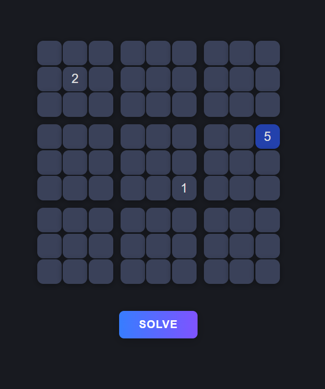

# Sudoku Solver
A simple web-based Sudoku solver built with React.

## Features
- Interactive 9x9 Sudoku board
- Enter numbers using keyboard (1-9, Backspace/Delete to clear)
- Solve button to automatically solve the puzzle
- Input validation and error handling
- Option to reset and try again

## Screenshot


## Getting Started

### Prerequisites

- [Node.js](https://nodejs.org/) (v14 or higher recommended)
- [npm](https://www.npmjs.com/) (comes with Node.js)

### Installation
1. Clone or download this repository.
   ```sh
   git clone https://github.com/MAHanupriSAR/SudokuSolver.git

2. Change directory to *SudokuSolver*
   ```sh
   cd SudokuSolver
   ```

3. Install dependencies:
   ```sh
   npm install
   ```

### Running the App
Start the development server:
```sh
npm start
```
Open [http://localhost:3000](http://localhost:3000) in your browser to use the Sudoku solver.

## Usage
- Click on a square and enter a number (1-9) to fill it.
- Use Backspace or Delete to clear a square.
- Click **SOLVE** to solve the puzzle.
- If the puzzle is invalid, you'll see an error message and can try again.
- Click **SOLVE AGAIN** or **TRY AGAIN** to reset the board.

## Project Structure
```
public/
  index.html         # Main HTML file
  manifest.json      # Web app manifest
  robots.txt         # Robots exclusion file
src/
  Game.js            # Main React component (UI logic)
  sudokuSolver.js    # Sudoku solving algorithm
  game.css           # Styles for the game
  index.js           # App entry point
  index.css          # Global styles
```

## License
This project is licensed under the [MIT License](LICENSE).
